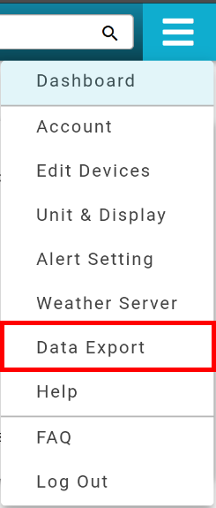
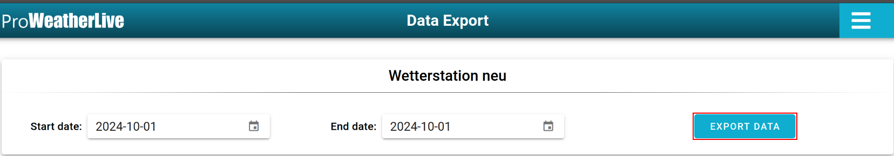
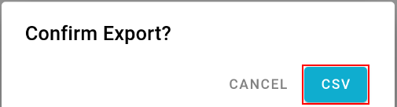
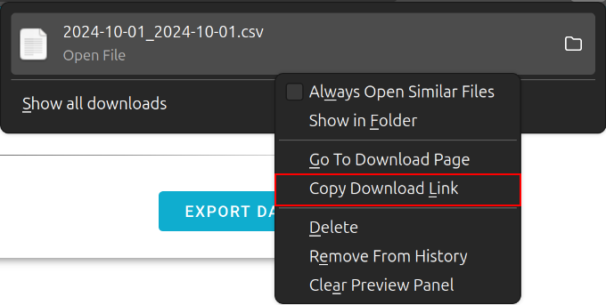

# Getting the ProWeatherLive Device ID

This project requires a device ID to be able to access the ProWeatherLive API. This device ID is unique per weather station. To get the device ID, you need to follow these steps:

### 1. Go to the [ProWeatherLive website](https://proweatherlive.net/)

### 2. Log In to your account

### 3. After logging in, use the site's navigation to find the "Data Export" section



### 4. Click on the "EXPORT DATA" button for the weather station you want to get the device ID for



### 5. Click on the "CSV" button in the resulting dialog box



### 6. Once the CSV file is downloaded, right-click on the download entry and select "Copy Download Link"



### 7. Paste the link address in a text editor. It will look something like this

```
   https://proweatherlive.net/api/weatherMetrics/export
    ?device=abcdefghijklmnopqrstuvwx
    &startTime=2024-08-12T22%3A00%3A00.000Z
    &endTime=2024-08-13T21%3A59%3A59.999Z%
    &format=csv
    &units%5B0%5D%5Btype%5D=direction
    &units%5B0%5D%5Bunit%5D=m
    &units%5B1%5D%5Btype%5D=distance
    &units%5B1%5D%5Bunit%5D=km
    &units%5B2%5D%5Btype%5D=temperature
    &units%5B2%5D%5Bunit%5D=%C2%B0C
    &units%5B3%5D%5Btype%5D=baroPressure
    &units%5B3%5D%5Bunit%5D=hPa
    &units%5B4%5D%5Btype%5D=windSpeed
    &units%5B4%5D%5Bunit%5D=km%2Fh
    &units%5B5%5D%5Btype%5D=windDirection
    &units%5B5%5D%5Bunit%5D=16%20Pts
    &units%5B6%5D%5Btype%5D=rain
    &units%5B6%5D%5Bunit%5D=mm
    &units%5B7%5D%5Btype%5D=lightIntensity
    &units%5B7%5D%5Bunit%5D=Lux
    &units%5B8%5D%5Btype%5D=hcho
    &units%5B8%5D%5Bunit%5D=ppb
    &units%5B9%5D%5Btype%5D=coco2
    &units%5B9%5D%5Bunit%5D=ppm
    &%24accessToken=******************
    &locale=en
```

The device ID is the value of the `device` parameter in the URL. In this case, the device ID is `abcdefghijklmnopqrstuvwx`.

Now that you have the device ID, you can use it in the `PWL_DEVICE_ID` environment variable when running the PWL HomeAssistant application.
